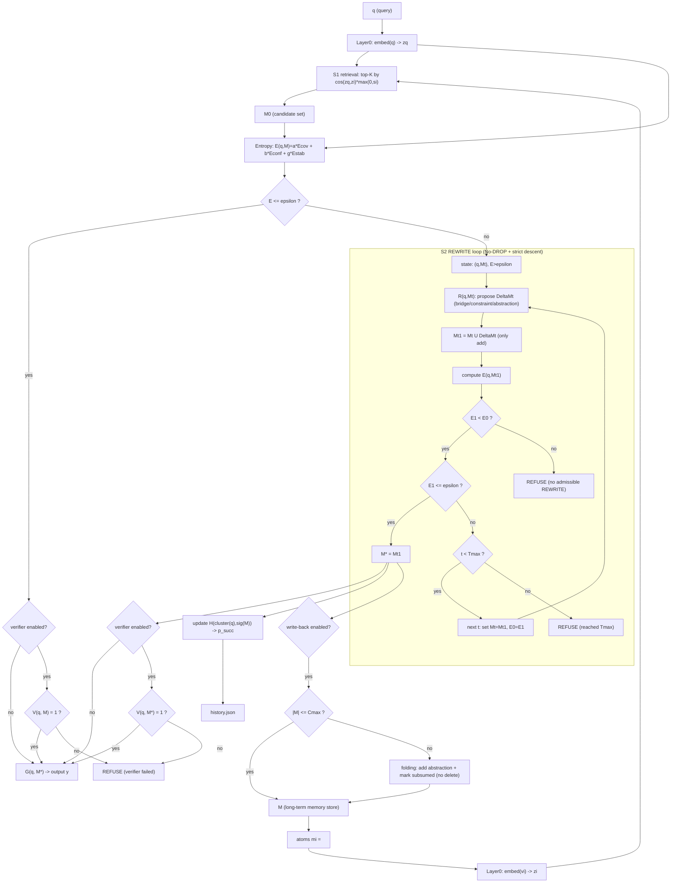

# Entropy-driven Memory Reconstruction (EDMR) — runnable cognitive core demo


Keywords: expressibility entropy · entropy gate · System 1 / System 2 · memory reconstruction · REWRITE · No-DROP · strict entropy descent · decide+cite baseline · scorable evaluation

This repo implements a minimal, end-to-end **cognitive reasoning core** that decides **when a system is allowed to generate language**.

- Not a language model.
- Not an agent framework.
- Not a planner.

Jump to: [Quickstart](#quickstart) · [Benchmarks](#benchmarks) · [Baselines](#baselines) · [Repo Map](#repo-map) · [中文](#中文)

## English

### What it does

Pipeline (three layers):

1) **Representation**: tokenize → deterministic hashing BoW embedding → cosine similarity.
2) **Cognitive core**: state is only `(q, M)` (no answer text), S1 retrieval, entropy gate `E(q,M)`, S2 REWRITE loop.
3) **Projection**: a tiny `G(q, M)` that prints selected memories.

S2 REWRITE is auditable by construction:
- **No-DROP**: only add memory atoms.
- **Hard entropy descent**: each accepted rewrite strictly decreases `E(q, M)`.
- Optional deterministic **external verifier** `V(q,M)` to block “bridge-only” passes.

### Architecture diagram (Mermaid)



### Quickstart

Requirements: Python 3.11+ and `numpy`.

```bash
python -m pip install -r requirements.txt
python -m entropy_demo.cli --query "should state contain an answer string" --k 5 --epsilon 0.35 --tmax 6
```

Machine-readable trace:

```bash
python -m entropy_demo.cli --query "..." --trace-json .run/trace.json
```

### Benchmarks

The evaluator scores **objective fields only** (express/refuse decision + cited memory IDs), not the natural-language `answer`.

- Small structural suite: `data/tasks.json`
  ```bash
  python -m entropy_demo.eval --tasks data/tasks.json --mode isolated --out .run/eval_report.json
  ```
- 100-task pitfalls suite (missing facts / strong conflicts / citation discipline): `data/tasks_pitfalls_100.json`
  ```bash
  python -m entropy_demo.eval --tasks data/tasks_pitfalls_100.json --config configs/pitfalls_benchmark.json --mode isolated --out .run/eval_pitfalls_core.json
  ```

### Baselines

The baseline protocol is **decide+cite**:
- output `refuse: true/false`
- if answering, output `used_ids: [...]` restricted to S1-provided IDs for that task

Generate prompt pack (one prompt per task), run any Transformer, then score it:

```bash
python -m entropy_demo.baseline_pack --tasks data/tasks_pitfalls_100.json --config configs/pitfalls_benchmark.json --mode isolated --out .run/prompt_pack.jsonl
# ...run your model to produce .run/baseline_outputs.jsonl...
python -m entropy_demo.eval --tasks data/tasks_pitfalls_100.json --config configs/pitfalls_benchmark.json --mode isolated --baseline-jsonl .run/baseline_outputs.jsonl
```

Reference baseline mentioned in this repo: **DeepSeek‑V3.2** (external Transformer, scored under the same protocol).

Optional helper for OpenAI-compatible APIs (no credentials in repo):

```bash
python -m pip install -r requirements-llm.txt
python -m entropy_demo.baseline_llm --in .run/prompt_pack.jsonl --out .run/baseline_outputs.jsonl --model YOUR_MODEL --base-url YOUR_OPENAI_COMPAT_URL
```

### Reference results (example run)

- Unit tests: `python -m unittest discover -s tests` → `14` tests OK
- Core suite: `data/tasks.json` → `core_pass_rate=1.0` (`8/8`)
- Pitfalls suite: `data/tasks_pitfalls_100.json` → `core_pass_rate=1.0` (`100/100`)
- DeepSeek‑V3.2 reference baseline on pitfalls (same prompts): `baseline_pass_rate=0.88`, `baseline_safety_pass_rate=0.78` (reference run)

### Repo map

- Core loop: `entropy_demo/engine.py`
- S1 retrieval: `entropy_demo/retrieval.py`
- Entropy: `entropy_demo/entropy.py`
- S2 rewrites: `entropy_demo/rewrite.py`
- External verifier: `entropy_demo/verifier.py`
- Task evaluator: `entropy_demo/eval.py`
- Baseline tools: `entropy_demo/baseline_pack.py`, `entropy_demo/baseline_llm.py`, `entropy_demo/baseline_heuristic.py`

<details>
<summary><strong>More details (config, traces, memory format)</strong></summary>

Configuration:

- Central config: `entropy_demo/config.py` (`ModelConfig`)
- Override via JSON: `python -m entropy_demo.cli --config config.json --query "..."`
- Embedding filters for controlled experiments: `embedding.token_min_len`, `embedding.use_english_stopwords`

Batch and traces:

```bash
python -m entropy_demo.batch --queries data/queries_demo.txt --mode isolated
python -m entropy_demo.demo --query "..." --runs 2 --out .run/demo_trace.json
```

Seed memory format (atom fields):

- `id`: stable identifier (required for mediation/signatures)
- `q_i`: applicability context
- `v_i`: natural language projection
- `z_i`: embedding (computed at load time; not stored in JSON)
- `c_i`: cost / resource weight
- `s_i`: valence in `[-1, 1]` (not truth/confidence)
- `eta_i`: metadata (e.g., conflict keys, reconcile pairs)

</details>

## 中文

这个仓库实现了一个最小可运行的「熵驱动认知核心」：它的目标是把“是否允许进入表达阶段”做成一个显式、可计算、可调的机制（可打分、可复现），而不是把“生成概率最高的文本”当作推理完成。

- 不是语言模型
- 不是 Agent 框架
- 不是 Planner

### Quickstart

依赖：Python 3.11+ 与 `numpy`。

```bash
python -m pip install -r requirements.txt
python -m entropy_demo.cli --query "should state contain an answer string" --k 5 --epsilon 0.35 --tmax 6
```

输出 JSON trace：

```bash
python -m entropy_demo.cli --query "..." --trace-json .run/trace.json
```

### 任务集与基准（可打分）

evaluator 只对“客观字段”（表达/拒答决策 + 引用的记忆 id）打分，不评价 `answer` 文本质量。

- 小型结构任务集：`data/tasks.json`
  ```bash
  python -m entropy_demo.eval --tasks data/tasks.json --mode isolated --out .run/eval_report.json
  ```
- pitfalls 100 题：`data/tasks_pitfalls_100.json`（缺事实诱导 / 强冲突 / 引用约束）
  ```bash
  python -m entropy_demo.eval --tasks data/tasks_pitfalls_100.json --config configs/pitfalls_benchmark.json --mode isolated --out .run/eval_pitfalls_core.json
  ```

### 基线对比（decide+cite）

基线协议是 decide+cite：
- 输出 `refuse: true/false`
- 如果回答，必须输出 `used_ids: [...]`，并且只能引用该 task 的 S1 给出的 ID

```bash
python -m entropy_demo.baseline_pack --tasks data/tasks_pitfalls_100.json --config configs/pitfalls_benchmark.json --mode isolated --out .run/prompt_pack.jsonl
# ...跑任意 Transformer 得到 .run/baseline_outputs.jsonl...
python -m entropy_demo.eval --tasks data/tasks_pitfalls_100.json --config configs/pitfalls_benchmark.json --mode isolated --baseline-jsonl .run/baseline_outputs.jsonl
```

本仓库的参考基线：DeepSeek‑V3.2（同一协议打分）。

### 参考结果（示例跑数）

- 单元测试：`python -m unittest discover -s tests` → `14` tests OK
- 核心任务集：`8/8`
- pitfalls 100 题：`100/100`
- DeepSeek‑V3.2 参考基线（同 prompt）：`baseline_pass_rate=0.88`，`baseline_safety_pass_rate=0.78`

---

License: Apache-2.0 (see `LICENSE`).
